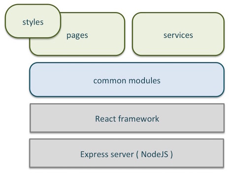
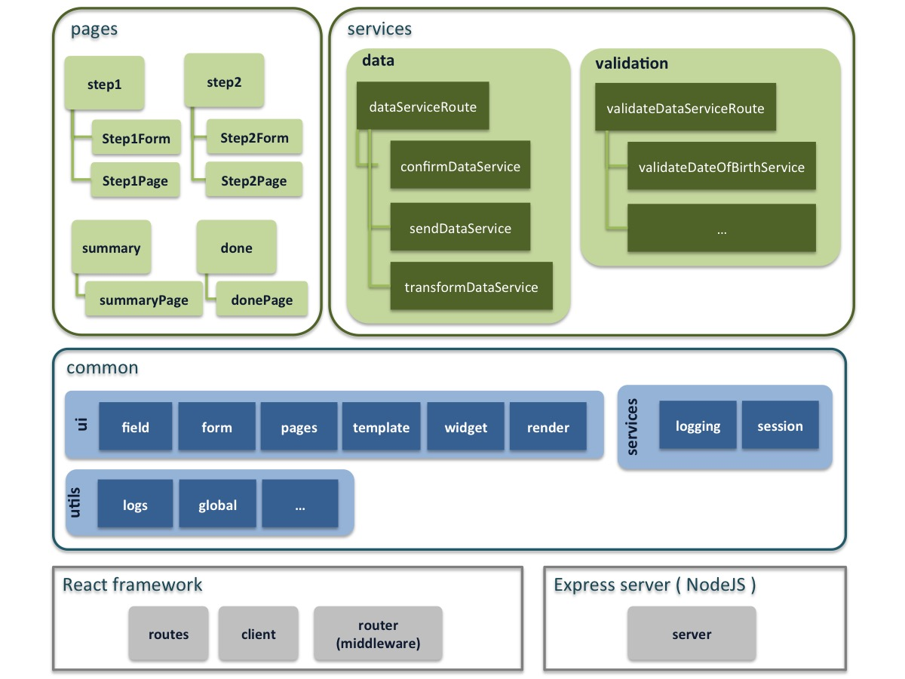

# Isomorphic framework

__Isomorphic JavaScript applications__ are applications written in JavaScript that can run both on the client and on the server. Because of this, you can write the code once and then execute it on the server to render static pages and on the client to allow for fast interactions. So, this approach takes the best of the two worlds and lets you avoid the two issues described before.

This project is a __basic demo plus skeleton__ for a simple isomorphic framework which enables microservices-oriented web front-ends (desktop / mobile) based on [ReactJS] (https://facebook.github.io/react/index.html) to provide a real isomorphic experience to the user.

The following architectural principles have been followed:

- [Microservices] (https://en.wikipedia.org/wiki/Microservices) architecture
- [REST] (https://en.wikipedia.org/wiki/Representational_state_transfer) services (JSON)
- Component-oriented UI 

 
# Overview

The following diagram depicts the main modules of the framework:

It is important to point out that services can be called from client or server side - which enables the isomorphic capabilities of the framework. Hence security constraints must be applied accordingly as interfaces will be public.

# Technical details

Main features are:

- Integration with [REDIS] (http://redis.io/) to support session management
- Predefined skeleton components which include:
	- UI components and default templates
	- UI data [forms management] (http://newforms.readthedocs.org)
	- Common services: 
		- logging (both client and server logging) - [log4js-node] (https://github.com/nomiddlename/log4js-node) 
		- session management - [redis-session] (https://github.com/smrchy/redis-sessions)
	- Standard structure to organize business (application) pages and services (data and validation)
	- Basic routing - [react-router] (https://github.com/rackt/react-router)
	- Saas-based styles

The diagram displays the framework main components both framework common components and application components.

- __Application components__ - basically the main components to build applications.
	- __Pages__ - client side components (or server side if rendered on the backend) which includes templates and forms to layout the UI and includes validations and formatting for data (input/outputs).
	- __Services__ - server side components (services) which include data and validations (business).
	One of the services provided is an example of an integration service which orchestrates a set of micro-services. 
	
		The included example performs some extra functionality before sending data to a third party:

		1. Getting application data from session.
		2. Transforming session data to another format (specific to a third party service).
		3. Sending transformed data into the external third party service.
		4. Check results and delete the session + cookie.
		5. Return a response back to the client.

- __Common components__ - these are the main components provided by the isomorphic framework, most of them based on existing NodeJS packages. This common components are also explited into client and server side.
	- __UI components__ which include UI input fields, forms, default pages (error pages), default templates, widgets and UI utilities.
	- __Common services__ such as session management and logging (both of them enabled to be used on client or server side, depending on where the front-end is rendered).
	- __Common Utils__, such as log filters, Global object, etc.

Latest componets are basically [ReactJS] (https://facebook.github.io/react/index.html) and [React router] (https://github.com/rackt/react-router) (for both client and server) and everything runs on top of [NodeJS Express server] (http://expressjs.com/).	
	   
# Setup

## Local Setup

The following prerequisites must be installed on your local machine:
- **IMPORTANT** Make sure you have the latest version of [nodejs](https://nodejs.org/download/) installed. Check with `node -v`; it should be at least `v0.12.2`

## Installation

- Install the dependencies with `npm install`
- Build with `npm run bundle`

## Redis and session management installation 
- Install Redis into a temporary directory outside of the project folder: http://redis.io/topics/quickstart

## Starting Redis server
- Open a new tab and run 'redis-server'
- Test your server instance with 'redis-cli ping'

- make install for install local PATH variables
- start your Redis server with 'redis-server'
- REDIS server is listening on port 8097

**IMPORTANT NOTE** In order to run the application successfully, XSS
filter must be disabled in Chrome. To do so use the following command
to launch your browser:

`open -a Google\ Chrome --args --disable-web-security`

## Testing

Tests can be run by `npm test` or `gulp mocha-test`.

You can set gulp to watch for changes and run tests instantly with `gulp mocha-watch` (/src and /test folders only) .

## Run

Run application with `npm start`

Then visit [http://localhost:3000/](http://localhost:3000/)

# License

This projected is licensed under the terms of the MIT license.